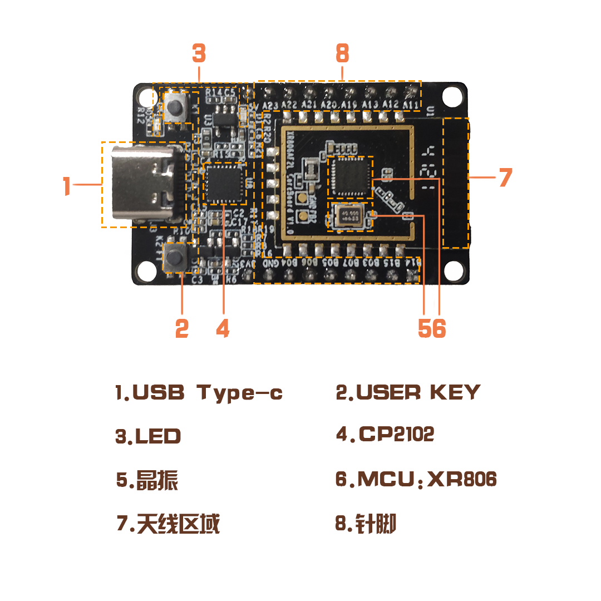
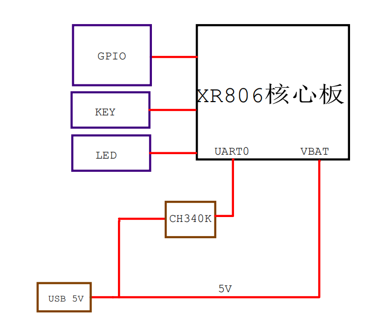

# XR806_OpenHarmony开发板

## 介绍

### 芯片介绍

XR806是全志科技旗下子公司广州芯之联研发设计的一款支持WiFi和BLE的高集成度无线MCU芯片，支持**OpenHarmony轻量设置系统**。具有集成度高、硬件设计简单、BOM成本低、安全可靠等优点。可广泛满足 **智能家居、智慧楼宇、工业互联、儿童玩具、电子竞赛、极客DIY** 等领域的无线连接需求。

### 开发板介绍

#### 开发板概述

XR806_OpenHarmony开发板是基于XR806芯片设计开发的参考评估，板身集成了XR806芯片、WiFi/BT双天线、供电系统、按钮及LED等，并引出了所有可用引脚，可供开发者进行方案评估、DIY或小规模产品研发使用。

#### 开发板外观图片

#### 模块框图

#### 参数规格

| 对象     | 参数                                 |
| -------- | ------------------------------------ |
| 主控     | XR806AF2L                            |
| DDR      | SIP 288KB SRAM                       |
| 存储     | SIP 160KB Code ROM. SIP 16Mbit Flash |
| 天线     | 板载WiFi/BT双天线，可共存            |
| 按键     | reboot按键x1，功能按键 x1            |
| 灯       | 红色电源指示灯 *1，蓝色可调节LED* 1  |
| 供电     | Type-C 5V                            |
| 引脚     | 插针引脚 *9                          |
| 调试方式 | Type-C（已板载串口转USB芯片）        |
| 晶振     | 外接40MHz晶振                        |

#### 关键特性

| 组件名         | 能力介绍                                                     |
| -------------- | ------------------------------------------------------------ |
| WLAN服务       | 提供WLAN服务能力。包括：station和hotspot（正在支持中）模式的连接、断开、状态查询等。 |
| BLUETOOTH 服务 | 提供BLE MESH 等功能。                                        |
| 模组外设控制   | 提供操作外设的能力。包括：I2C、I2S、ADC、UART、SPI、GPIO、PWM、FLASH等。 |
| 基础库         | 提供公共基础库能力。包括：文件操作、KV存储管理等。           |
| XTS            | 提供OpenHarmony生态认证测试套件的集合能力。                  |
| HDF            | 提供OpenHarmony硬件配置驱动的能力。                          |
| Kconfig        | 提供内核配置能力。                                           |

#### 引脚定义

| 引脚序号 | IO name | Function0 | Function1 | Function2    | Function3   | Function4 | Function5      | Function6 | Function7 | Function8 | Function9  |
| -------- | ------- | --------- | --------- | ------------ | ----------- | --------- | -------------- | --------- | --------- | --------- | ---------- |
| 1        | VBAT    | —         | —         | —            | —           | —         | —              | —         | —         | —         | —          |
| 2        | PA23    | Input     | Output    | DCXO_PUP_OUT | IR_RX       | FEM_CTRL1 | FEM_CTRL2      | EINTA23   | Z         | KEY_X7    | I2S_MCLK   |
| 3        | PA22    | Input     | Output    | UART2_TX     | CARD_DETECT | PWM3/ECT3 | SPI0_CLK       | EINTA22   | Z         | KEY_X6    | I2S_LRCLK  |
| 4        | PA21    | Input     | Output    | UART2_RX     | CARD_RST    | PWM2/ECT2 | SPI0_CS0       | EINTA21   | Z         | KEY_X5    | I2S_DO     |
| 5        | PA20    | Input     | Output    | UART2_CTS    | CARD_CLK    | PWM1/ECT1 | SPI0_MISO      | EINTA20   | Z         | KEY_X4    | AUDIO_PWMN |
| 6        | PA19    | Input     | Output    | UART2_RTS    | CARD_DATA   | PWM0/ECT0 | SPI0_MOSI      | EINTA19   | Z         | KEY_X3    | AUDIO_PWMP |
| 7        | PA13    | Input     | Output    | ADC_CH3      | PWM5/ECT5   | I2S_DI    | UART2_TX       | EINTA13   | Z         | KEY_Y5    | TWI0_SDA   |
| 8        | PA12    | Input     | Output    | ADC_CH2      | PWM4/ECT4   | I2S_BCLK  | IR_TX          | EINTA12   | Z         | KEY_Y4    | TWI0_SCL   |
| 9        | PA11    | Input     | Output    | ADC_CH1      | SPI0_MISO   | I2S_MCLK  | UART1_TX       | EINTA11   | Z         | KEY_Y3    | IR_RX      |
| 10       | VDD     | —         | —         | —            | —           | —         | —              | —         | —         | —         | —          |
| 11       | GND     | —         | —         | —            | —           | —         | —              | —         | —         | —         | —          |
| 12       | PB04    | Input     | Output    | SPI0_MOSI    | PWM0/ECT0   | UART1_RTS | FLASH_MOSI/IO0 | EINTB4    | Z         | KEY_Y12   | I2S_BCLK   |
| 13       | PB06    | Input     | Output    | SPI0_CS0     | PWM2/ECT2   | UART1_RX  | FLASH_CS0      | EINTB6    | Z         | KEY_Y14   | I2S_DO     |
| 14       | PB05    | Input     | Output    | SPI0_MISO    | PWM1/ECT1   | UART1_CTS | FLASH_MISO/IO1 | EINTB5    | Z         | KEY_Y13   | I2S_DI     |
| 15       | PB07    | Input     | Output    | SPI0_CLK     | PWM3/ECT3   | UART1_TX  | FLASH_CLK      | EINTB7    | Z         | KEY_Y15   | I2S_LRCLK  |
| 16       | PB03    | Input     | Output    | UART0_RTS    | JTAG_TDI    | PWM7/ECT7 | FLASH_HOLD/IO3 | EINTB3    | Z         | KEY_Y11   | SWD_TCK    |
| 17       | PB15    | Input     | Output    | UART1_RX     | UART2_RX    | TWI1_SDA  | UART0_RTS      | EINTB15   | Z         | KEY_Y1    | PWM6/ECT6  |
| 18       | PB14    | Input     | Output    | UART1_TX     | UART2_TX    | TWI1_SCL  | UART0_CTS      | EINTB14   | Z         | KEY_Y0    | PWM5/ECT5  |

- [更多硬件资料](./docs/硬件资料)

## 快速入门

xr806_openharmony开发板的开发依赖于device_soc_allwinner_xradio_xr806的代码。[点击跳转](https://gitee.com/openharmony-sig/device_soc_allwinner_xr806)
