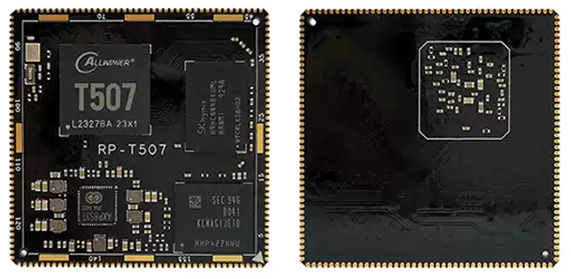

# device_board_seed

#### 开发板介绍
​		EVB_OH1是一片尺寸为150mm*100mm*15mm的开发板，其结构紧凑，功能强大，外形美观，开发板上搭载有庞大的资源外设，同时开发板可搭载OpenHarmony操作系统，配套有DevEco Device Tool开发、调试环境，部分教程以及实验案例，开发者可以根据需求自由开发。EVB_OH1的外观如图1所示。


​		EVB_OH1板载有丰富的外设资源，便于多应用的开发和部署：

1、全志T507四核、主频 1.5GHz CPU； Mali-400 G31 GPU；

  标配LPDDR4 2G内存；

  标配eMMC 8G存储器；

2、Ethernet接口

3、3个USB，支持OTG

4、HDMI视频输出

5、LCD视频输出

6、Audio接口

7、支持4G、5G通讯 背部SIM卡

8、CAN总线接口

9、Wi-Fi/蓝牙

10、Camera接口

11、SDIO接口

12、CH340接口

13、Type-C电源接口

14、User's Key

15、E53 案例接口


​		核心板芯片是一个[全志](https://www.forlinx.com/product/t3-95.html)T507高性能四核处理器。电源管理芯片AXP853T支持待机，按键开关机。工作电压为5V，最大功率小于2W。支持Andriod/Linux+QT/Harmony	OS系统，工业级运行温度-25~75℃，连续运行寿命大于5年。全志T507如图3所示。常用接口参数说明如下：



全志T507接口参数：

* 拥有4路独立USB接口，其中一路为OTG
* UART 串口6路TTL3.3V电平，其中一路为Debug
*  98路GPIO接口（备注：有复用功能）
*  6路PWM3.3V电平（备注：有复用功能）
*  LVDS显示为一路LVDS最大支持1920*1080 1080P60fps
* RGB显示为一路RGB888输出最大支持1920*1080 1080P60fps HDMI显示 一路HDMI输出 支持4K 60fps输出
* 一路CVBS输出
* CAN总线包括一路CAN BUS2.0总线 两路SDIO接口，一路TF卡，另一路接 WIFI
* 两路ADC接口
* 5路I2C接口
*  两路以太网，GMAC和EMAC PHY 接口
* 多路电源输出1.8V 3.3V
* 支持本地USB系统升级

全志T507应用处理器框图如图4所示。


​		EVB_OH1开发板的Ethernet接口采用单口RJ45 Hanrun-HR911105A插头，直插式传输效率可达100M。三个具有OTG可扩展的USB接口可方便开发者与PC、移动设备、存储设备等进行数据交换。高清晰度多媒体接口HDMI（High Definition Multimedia Interface）是一种数字化视频、音频接口技术，支持传送无压缩的音频信号及高分辨率视频信号，最高支持1080P视频。LCD Interface可直接连接液晶显示屏，实现界面交互。Audio接口可传输高质量的音频。4G、5G通讯模块选用单通道IP101GR以太网芯片。芯片类型为Ethernet Transceivers，接口类型有四种MII, RMII, TP, Fiber，工作电压为3.3V。CAN接口集成电路High Speed EMC Opt CAN Transceiver选用芯片为SN65HVD1050DR总线接口是一种功能丰富的车用总线标准。用于和汽车等设备的相互通信，也可用于其他行业。图5为芯片SN65HVD1050DR内部原理。


​		WIFI/蓝牙模块采用芯之联XR829芯片。它是一颗支持802.11b/g/n和蓝牙2.1/4.2的2.4GHz单芯片，集成了SDIO接口的无线局域网（WLAN）控制器和UART接口的蓝牙2.1/4.2控制器。它将无线局域网MAC、基带和射频集成在一个芯片中。XR829为高吞吐量、低功耗的无线局域网设备提供了WiFi和蓝牙的完整解决方案。芯片XR829工作流程如图6所示。


Camera接口可供开发者实现图像采集识别功能，广泛应用于人脸识别，智能摄像头、安防监控、车载记录仪等系统。

SDIO接口支持外部SD-Card扩展。CH340作为USB总线的转接芯片，实现USB转串口、USB转IrDA红外或者USB转打印口。

Type-C电源接口为系统提供一个稳定的5V/3A电源。用户按键为两个可编译按键F1，F2,一个复位按键RST，一个动力模式按键PWR。

板上搭载的E53接口，是一种资源丰富、易于扩展的标准接口，通过接入标准的E53案例扩展板，可以很容易的实现多种应用的开发和部署。E53接口标准如图7所示


* 一路SPI（Synchronous Peripheral Interface）接口
* 一路UART（Uni[versal](https://www.elecfans.com/tags/Versal/) Asynchronous Receiver & Transmitter）接口
* 一路IIC（The Inter Integrated Circuit）接口
* 一路DAC（Digital to [Analog](https://www.elecfans.com/tags/Analog/) Converter）接口
* 一路ADC（[Analog](https://www.elecfans.com/tags/Analog/) to Digital Converter）接口
* 五路GPIO（General Purpose Input/Output）接口
* 双路电源（5.0V/3.3V）输入

​		搭载全志工业级T507芯片的EVB_OH1开发板，拥有强大的编解码能力和丰富的外围接口，与物联网新贵OpenHarmony L2 OS相结合，满足工业控制、智能驾舱、智慧家居、智慧电力、在线教育等诸多行业需求。

#### 搭建开发环境

1）注册码云gitee账号。

2）注册码云SSH公钥，请参考[码云帮助中心](https://gitee.com/help/articles/4191)。

3）安装[git客户端](https://gitee.com/link?target=http%3A%2F%2Fgit-scm.com%2Fbook%2Fzh%2Fv2%2F%E8%B5%B7%E6%AD%A5-%E5%AE%89%E8%A3%85-Git)和[git-lfs](https://gitee.com/vcs-all-in-one/git-lfs?_from=gitee_search#downloading)并配置用户信息。

```
git config --global user.name "yourname"

git config --global user.email "your-email-address"

git config --global credential.helper store
```

4）安装码云repo工具，可以执行如下命令。

```
curl -s https://gitee.com/oschina/repo/raw/fork_flow/repo-py3 > /usr/local/bin/repo #如果没有权限，可下载至其他目录，并将其配置到环境变量中

chmod a+x /usr/local/bin/repo

pip3 install -i [https://repo.huaweicloud.com/repository/pypi/simple](https://gitee.com/link?target=https%3A%2F%2Frepo.huaweicloud.com%2Frepository%2Fpypi%2Fsimple) requests
```


#### 获取代码流程
```
mkdir openharmony

cd openharmony

通过repo + https 下载。
repo init -u https://gitee.com/openharmony-sig/manifest.git -b master --no-repo-verify -m devboard_seed.xml

下载当前分支的代码:
repo sync -c

下载部分大容量二进制文件:
repo forall -c 'git lfs pull'

在源码根目录下执行脚本，安装编译器及二进制工具。
./build/prebuilts_download.sh
```


#### 代码框架

```
/device/board/seed
├── T507
  ├── audio        #audio  驱动代码
  ├── camera       #camear 驱动代码
  ├── config       #开发版配置文件
  └── wifi         #WiFi   驱动代码
```


#### 编译流程

```
1） 进入源码根目录，执行如下命令进行版本编译。
1 ./build.sh --product-name T507 --gn-args linux_kernel_version=\"linux-4.19\"   # 编译T507 L2的system.img/vendor.img等

2. cd ./device/soc/allwinner/build    # 重新进入allwinner/build目录

3. ./pack.sh                          # 生成img镜像文件

4. cd ../../../../out                # 进入out目录可看到生成的镜像文件

# 镜像文件为：t507_linux_bearpi_uart0.img
```


#### 使用工具LiveSuit_V1.0.0.1烧录
1. 下载方式：
   https://gitee.com/vyagoo_0/seed_tools/tree/master/tools

2、连接好数据线和串口线；

3、打开烧录软件，选择好要烧录的镜像文件；

4、使用类MobaXterm等工具打开串口，串口可读写的前提按住键盘键"2",然后按这样机的reset键，软件自动进入烧写模式，等待烧写成功即可。
