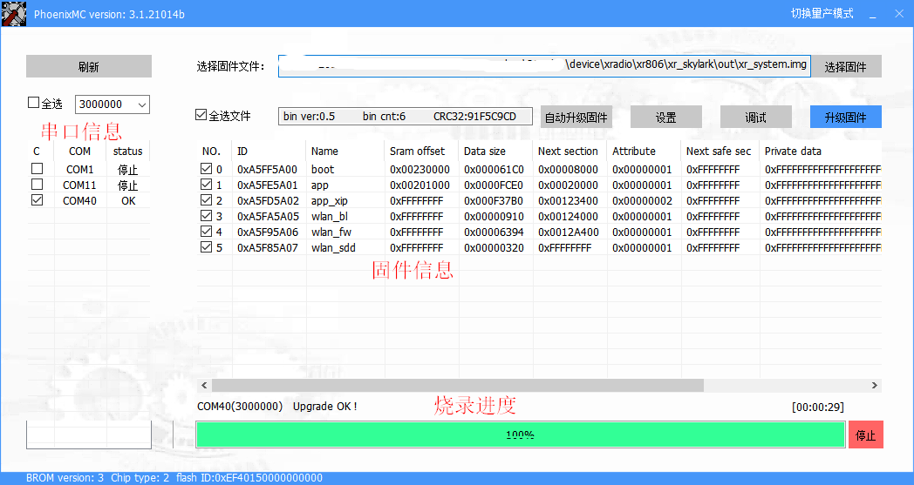
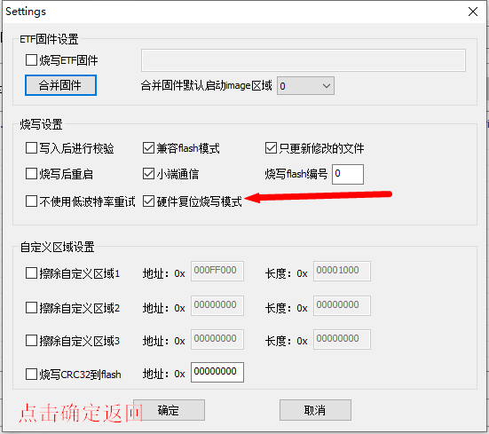
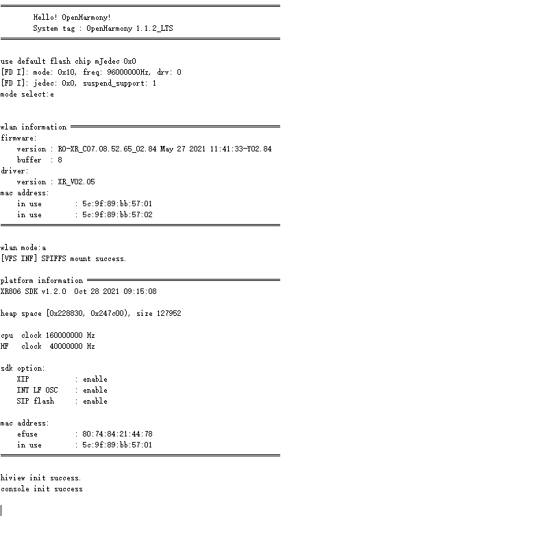

# 固件烧录

- [固件和烧录软件位置](#固件和烧录软件位置)
- [烧录说明](#烧录说明)
- [常见问题](#常见问题)

## 固件和烧录软件位置

编译生成的固件保存在device/xradio/xr806/xr_skylark/out目录下，文件名固定为xr_system.img。

烧录软件保存在device/xradio/xr806/xr_skylark/tools下，名称为phoenixMC_xxxx.exe。

## 烧录说明

### 烧录软件界面

### 操作步骤

1. PC安装CP2102驱动。([点击下载](https://www.silabs.com/developers/usb-to-uart-bridge-vcp-drivers))
2. 串口连接：通过USB-typeC数据线连接开发板和PC。
3. 串口设置：点击左上角的“刷新”按钮可刷新已连接串口设备列表，勾选开发板对应的COM口。串口波特率最大支持3000000，波特率越高，烧录速度越快。如果高波特率下容易出现烧录失败，可检查串口线、串口驱动是否稳定支持该波特率；或者降低波特率进行尝试。为了避免烧录速度过慢，建议波特率选择大于等于921600。
4. 固件选择：点击“选择固件”按钮选择需要烧录的固件文件（xr_system.img），固件信息栏会显示出当前固件的详细信息。另外，通过拖拽方式将固件直接拖入工具界面也可以达到同样的效果。
5. 开启一键烧录功能：点击“设置”按钮调出设置界面，如下图勾选“硬件复位烧写模式”

6. 启动烧录：点击“升级固件”按钮启动固件烧录。烧录状态栏显示当前选定串口对应设备的烧录进度和状态。当烧录成功时，进度条会达到100%的进度并显示为绿色；当烧录失败时，进度条显示为红色并报告错误。

7. 复位设备：固件烧录成功后，开启PC串口调试工具（115200，N，8，1），硬件复位开发板（按下复位按钮），将看到以下打印输出。

   

## 常见问题

### 驱动已经安装，点击刷新没反应

排查是否有其他工具占用了串口，类似的情况还有点击升级时，烧录软件提示：open uart error！

### 进度95%失败

点击“设置”，勾选“写入后进行校验”。

### 显示synchron error！

1. 检查“设置”界面的“硬件复位烧写模式”是否勾选。
2. 如果开发板能正常工作，使用串口输入upgrade后，再进行烧录。

3. 如果开发板不能工作，检查开发板C3是否漏焊或者虚焊。如果焊接正常尝试使用镊子或其他办法短接开发板上的GND和PB2两个焊点之后，按下复位按键，再进行烧录。

