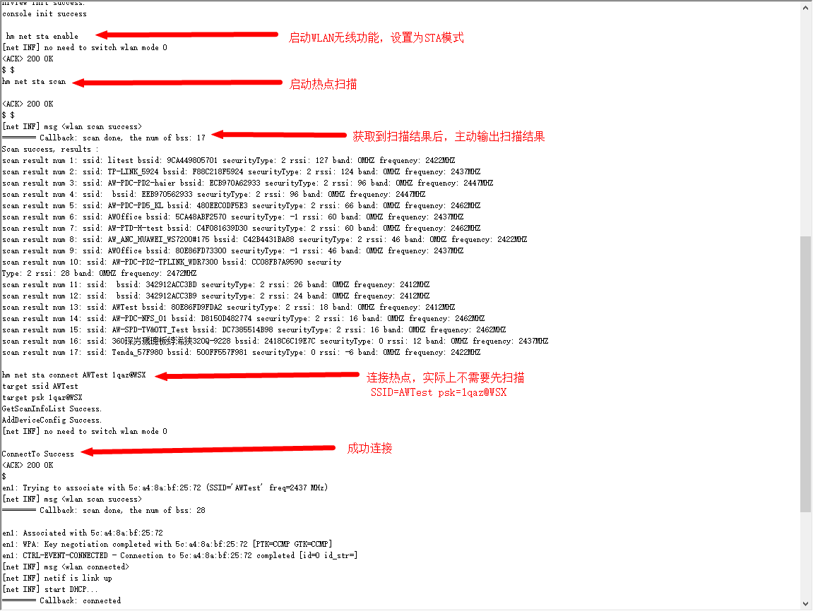

# 功能展示

- [功能说明](#功能说明)
- [功能演示](#功能演示)
- [更多功能](#更多功能)

## 功能说明

XR806_OpenHarmony开发板集成了console（控制台）功能，在PC上使用串口调试助手可以通过命令直接控制开发板。所有命令的形式统一为：

命令词1（空格）命令词2（空格）命令词3（空格）........

## 功能演示

以无线扫描、连接为例，串口命令如下。

启动WLAN。

```
hm net sta enable
```

扫描热点

```
hm net sta scan
```

连接热点，在不进行扫描的情况下，connect默认加密方式为WPA/WPA2，如果连接失败，可以先扫描后再重新连接。PSK为空时，默认为开放热点。

```
hm net sta connect < ssid > < psk >
```

实例如下图所示。



## 更多功能

SDK已经实现的功能统计在[命令用例](./XR806-harmony-命令例.xlsx)中，更多功能等你发现。

